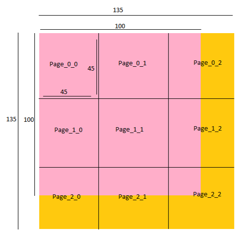

# DS Project Phase-0

## Part-2: : Extending SimpleRA to Include Matrices

Given a large square matrix of size *n x n (n &le; 10<sup>5</sup>)* containing unsigned integer, we need to store it in the SimpleRA. Unlike the tables, there might be some cases for matrices where we cannot store even one whole row in a single page as it might exceed MaxBlockSize i.e. *8 KB*.

The approach we have used in implementation is to divide the larger square matrix *(NxN)* into smaller square sub-matrices of definite size *(MxM)*.
Each submatrix is stored in a separate page.

Size of the smaller matrix *(MxM)* depends on the BLOCK_SIZE and can be calculated as:
    `M = (floor)sqrt((BLOCK_SIZE*1024)/(sizeof(int)))`

Given `BLOCK_SIZE = 8 KB`, it gives *M = 45*.

---

### Page Layout


Each page stores a submatrix of maximum size *45 x 45*.

> Considering an *100 x 100* sized matrix,
> Each page has an index to indicate submatrix row and submatrix column.


---
### CROSS_TRANSPOSE

Given two matrices A and B, CROSS_TRANSPOSE is a kind of operation such that after execution A becomes B<sup>T</sup> and B becomes A<sup>T</sup>. That is the blocks corresponding to the original matrix A now store the transpose of the matrix B and similarly the blocks corresponding to the original matrix B now store the transpose of the matrix A.

To implement **CROSS_TRANSPOSE** we calculate transpose of each block of a matrix and then exchange Page_i_j of matrix A with Page_j_i of matrix B. 

The `executeCrossTranspose()` function works as follows:

1.  Take matrix1 and matrix2 from matrixCatalogue.
2. Loop `block_i` from *0* to *number of rows of submatrices(blocks)* and loop `block_j` from *0* to *number of columns of submatrices* (nested loops). 
2. Get the page corresponding to `(block_i, block_j)` for matrix1 and the page corresponding `(block_j, block_i)` for matrix2.
3. Retrieve the submatrices from each of these pages.
4. Transpose each matrix internally.
5. Write the second matrix into the first page and the first matrix into the second page.

---
## Part-3: Extending Part 2 to Sparse Matrices

Here, we need to propose a page layout in which we can store sparse matrices efficiently. A sparse matrix is a matrix with count of `zero elements > 0.6 * size of matrix`. With this being known, we can compress the memory required to store a given matrix by only storing the data of non-zero elements of the matrix.


---
### Page Layout

The compression technique used here is ***Compressed Sparse Row (CSR)***

Assume a *m x n* matrix with NNZ number of non-zero elements. To store this matrix using CSR algorithm, we use three vectors as described below.

**A Vector**: The A vector is of size NNZ and it stores the values of the non-zero elements of the matrix. The values appear in the order of traversing the matrix row-by-row.

**IA vector**: The IA vector is of size m+1 stores the cumulative number of non-zero elements upto ( not including) the i-th row. It is defined by the recursive relation :
IA[0] = 0
IA[i] = IA[i-1] + no of non-zero elements in the (i-1) th row of the Matrix

**JA vector**: The JA vector stores the column index of each element in the A vector. Thus it is of size NNZ as well.

We can store each vector individually in a page or store A and JA together in a page and IA separately in a different page.


The sparsity of the matrix is the measure of emptiness or sparseness of a given matrix.

* Mathematically, 
Sparsity = Number of zeroes present in Matrix /  Total No of Elements 
Sparsity  = 1 – NNZ/N<sup>2</sup> (For a square matrix of size N)
- If ***no compression*** technique is used, then every element of the matrix is stored into memory. Hence space required = **N<sup>2</sup> x sizeof(uint)**
* Where as, in case of **CSR**, space required = **[(2 x NNZ) + (N+1)] x sizeof(uint)**

- CSR matrices are memory efficient as long as space `NNZ < (N * (N-1) - 1)/2`.

* **Percentage of sparseness ( P )** =  Sparsity * 100 =  *(1 – NNZ/N<sup>2</sup>) \* 100*
Non-Zero elements in terms of P  ->   **NNZ** = *(1 - P / 100) * N<sup>2</sup>*

* **Compression Ratio** [(WikiSource)](https://en.wikipedia.org/wiki/Data_compression_ratio)
= Memory required without compression/ Memory required after compression
= *(N<sup>2</sup>)/(2NNZ + N + 1)*
=*(N<sup>2</sup>)/{(2 \* (1 - P / 100) \* N<sup>2</sup>) + N + 1}* 

    
Solving the above, we get: 


- For a given matrix size N, as P increases Compression Ratio increases, i.e., when there are more zeroes, the memory required after compression is lower.


*N = Size of matrix*
*NNZ = Number of non-zero elements in the matrix*

#### Transpose for Sparse Matrices

Let the page storing A and JA be P.

Algorithm:
```
loop (i=0; i<matrix_size; i++){
	loop(j=0; j<P.size(); j++){
		get a new (a, ja) pair from P
		P.second = Column index of a in original matrix = Row index of a in original matrix]
		if(P.second == i){
			element corresponding to this (a,ja) pair will be present in ith row of transpose matrix.
			But we still need to find its corresponding column index in transpose
			We loop over IA vector to find the row this element belongs to in A and hence the column it belongs to in transpose.
			Reset cursor for IA page to IA_0 and then loop over it until we find the next largest element than j
			Store this pair for next traversal
		}
	}
}
```
---


